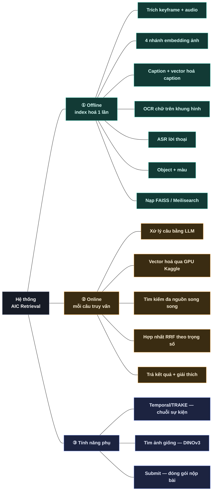
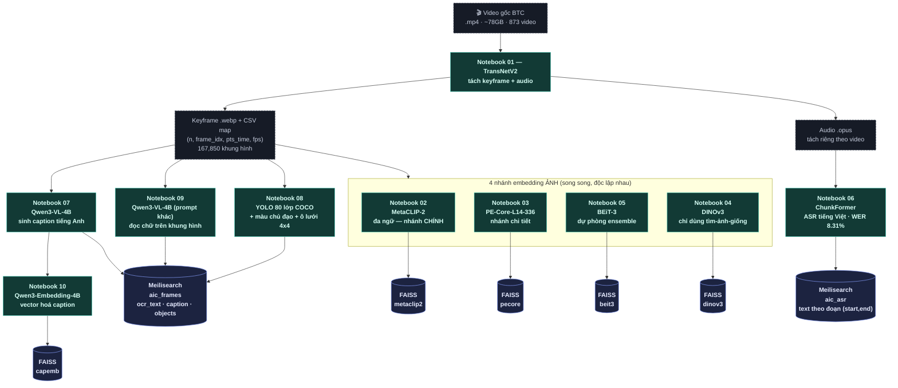
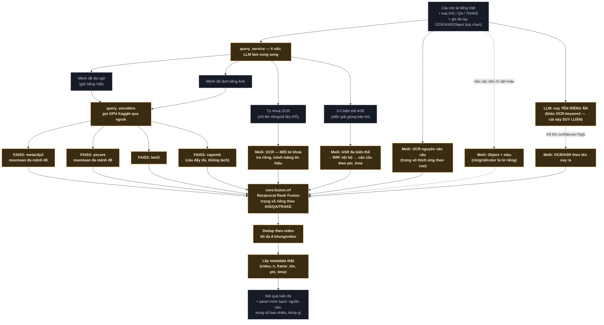
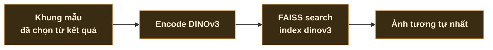
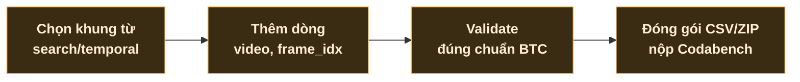

# Pipeline hệ thống — từ video thô đến kết quả tìm kiếm

Toàn bộ luồng xử lý của hệ thống, chia làm 2 giai đoạn tách biệt: **offline**
(index hoá dữ liệu — chạy 1 lần, trên GPU Kaggle) và **online** (xử lý mỗi câu
truy vấn — chạy real-time khi dùng). Input/output từng bước ghi rõ để biết chỗ
nào có thể đo lại, thay model, hay chỉnh trọng số.

Chú thích màu: 🟢 module offline (index hoá) · 🟠 module online (truy vấn) ·
🔵 lưu trữ/hạ tầng · ⬜ dữ liệu input/output.

---

## 0 · Toàn cảnh

---

## 1 · Offline — Index hoá dữ liệu

Chạy 1 lần trên GPU Kaggle free (notebook `01`–`10`, xem
[`indexing/kaggle/`](indexing/kaggle/)), output là các file/vector nạp thẳng
vào FAISS + Meilisearch — máy dev không cần GPU cho bước này.

### Chi tiết từng module

| Module | Input | Model | Output |
|---|---|---|---|
| Keyframe + audio | video `.mp4` | TransNetV2 (phát hiện chuyển cảnh) | `.webp` + CSV map + `.opus` — 167,850 khung (dedup từ 182,422) |
| 4 nhánh embedding ảnh | keyframe `.webp` | MetaCLIP-2 / PE-Core-L14-336 / BEiT-3 / DINOv3 | vector 1024 chiều/nhánh → FAISS index riêng |
| Caption + Cap-Embedding | keyframe `.webp` | Qwen3-VL-4B → Qwen3-Embedding-4B | câu tiếng Anh + vector 2560 chiều → FAISS `capemb` + Meilisearch `caption` |
| OCR | keyframe `.webp` | Qwen3-VL-4B (prompt "chỉ liệt kê chữ nhìn thấy") | Meilisearch `ocr_text` (ngram 2-5) |
| ASR | audio `.opus` | ChunkFormer (WER 8.31%) | Meilisearch `aic_asr` — 111,411 đoạn theo (start, end) |
| Object + màu | keyframe `.webp` | YOLO (80 lớp COCO) + màu chủ đạo (11 màu cơ bản) + ô lưới 4×4 | Meilisearch `objects` (cls/grid/color là TỪ RIÊNG, vd "bicycle 2a red") |

**Vì sao tách nhiều nhánh embedding?** Mỗi model "nhìn" ảnh khác nhau (đa ngữ
vs. chi tiết vs. ensemble) — giai đoạn online sẽ hợp nhất kết quả của tất cả
bằng RRF thay vì chọn 1 model duy nhất, bù trừ điểm yếu cho nhau.

---

## 2 · Online — Xử lý 1 câu truy vấn

Chạy real-time mỗi lần bấm Tìm kiếm — encode qua GPU Kaggle (không cần GPU
máy dev), search FAISS/Meilisearch song song rồi hợp nhất.

### Chi tiết từng bước

| Bước | Vì sao thiết kế vậy |
|---|---|
| Trích mệnh đề / dịch | Câu dài bị cắt/mờ tín hiệu ở model CLIP-family (giới hạn ~77 token) — LLM tách thành nhiều câu ngắn, mỗi câu tra riêng rồi gộp. |
| maxmean đa mệnh đề | Mỗi mệnh đề search FAISS riêng (topk rộng) → hợp candidate → điểm = `max + 0.3×mean` qua các mệnh đề khớp — thắng RRF/MAX/MEAN thuần khi đo thật. |
| OCR-keyword riêng lẻ | Đã đo thật: tên riêng hiếm (2/167,850 khung) bị từ phổ biến áp đảo nếu tra chung 1 câu — tách riêng từng từ khoá sửa đúng vấn đề. |
| ASR theo ý nghĩa | Transcript thật hiếm dùng đúng từ câu hỏi — LLM đóng vai phóng viên diễn đạt lại 3-5 cách, rồi mới tra BM25, fuse nội bộ thành 1 tín hiệu. |
| Object + màu | CHỈ bật khi câu nêu rõ vật+màu đặc trưng (regex chặt) — vật thể chung chung 1 mình dễ làm loãng vì xuất hiện khắp nơi. |
| RRF hợp nhất | `score = Σ weight / (60 + rank + 1)` — miễn nhiễm với thang điểm khác nhau giữa cosine similarity và BM25. |

**Điểm cốt lõi:** mọi trọng số (OCR/ASR/object/entity so với hình ảnh) đều đo
được bằng số trong [`core/config.py`](core/config.py), khác nhau theo
KIS/QA/TRAKE — không phải đoán, chỉnh ở đúng 1 chỗ.

---

## 3 · Tính năng phụ — Temporal, tìm ảnh giống, nộp bài

3 luồng riêng, dùng lại module đã có ở trên nhưng ghép khác nhau cho từng mục
đích.

### Temporal / TRAKE — tìm chuỗi sự kiện đúng thứ tự

```mermaid
flowchart LR
  classDef online fill:#3a2c12,stroke:#ffb454,color:#ffefd8,font-weight:600;
  EV["Sự kiện E1..En<br/>theo thứ tự"]:::online --> STRIP["Bỏ khung mẫu câu<br/>'Khoảnh khắc đầu tiên...'"]:::online
  STRIP --> ENCE["Encode từng event<br/>metaclip2"]:::online
  ENCE --> ANCHOR["Boundary-anchor<br/>search riêng E1 & En<br/>→ giao tập video"]:::online
  ANCHOR --> CAP150["Cắt còn ≤150 video<br/>giữ thứ tự rank"]:::online
  CAP150 --> FETCH["Lấy TOÀN BỘ vector<br/>của từng video"]:::online
  FETCH --> BONUS["+ điểm thưởng OCR/ASR<br/>nếu event nhắc chữ/lời"]:::online
  BONUS --> DP["DANTE DP<br/>chuỗi khung tăng dần thời gian,<br/>tối ưu cosine − phạt khoảng cách"]:::online
  DP --> SEQ["Chuỗi khung kết quả<br/>đúng thứ tự sự kiện"]:::online
```

### Tìm ảnh giống (image-to-image)

### Submit — đóng gói nộp bài

---

Sơ đồ phản ánh code thật trong `aic-system/` tại thời điểm viết — khi đổi
model/trọng số, cập nhật lại file này để nhóm luôn nhìn đúng trạng thái hệ
thống.
